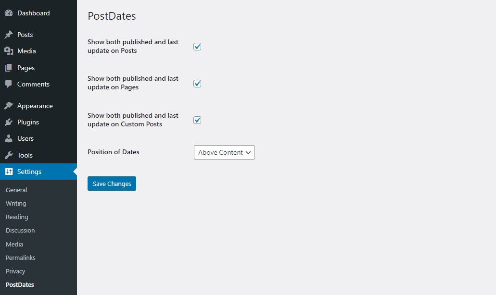

# PostDates Plugin

A simple WordPress plugin that displays the publication and last update date on posts, pages, and custom post types.

## Description

PostDates allows you to easily display the publication and last update dates for your content. It includes a settings page where you can configure which dates to show and their position.

## Installation

1. Upload the plugin files to the `/wp-content/plugins/postdates` directory, or install the plugin through the WordPress plugins screen directly.
2. Activate the plugin through the 'Plugins' screen in WordPress.
3. Use the Settings -> PostDates screen to configure the plugin.

## Frequently Asked Questions

**How do I change the position of the dates?**

Go to the plugin settings page and select the desired position (above or below the content).

## Screenshots

1. Plugin setting
   
   
    
2. Display on page
   
   
   

## Changelog

See [CHANGELOG.md](CHANGELOG.md) for the full changelog.

## User Guide

For a detailed user guide, see [user-guide.md](user-guide.md).

## License

This plugin is licensed under the GPLv2.0. See [LICENSE](LICENSE) for more information.
